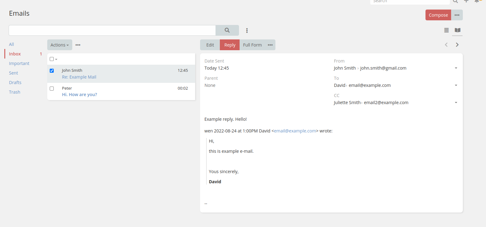

# Module - Email Combined View

Quickly view e-mails in a compact combined view.

## Table of Contents

* [Introduction](#introduction)
* [Requires](#requires)
* [Installation](#installation)
    * [Pre-build extension release](#pre-build-extension-release)
    * [Build from source](#build-from-source)

## Introduction

Quickly view e-mails in a compact combined view.



## Requires

- EspoCRM >= 7.0
- PHP >= 7.2

## Installation

### Pre-build extension release

1. Download the latest release from [Release page](https://github.com/mozkomor05/espocrm-email-preview-extension/releases/latest).
2. Go to **Administration** -> **Extensions** and upload the downloaded file.

### Build from source

1. Make sure than `node`, `npm` and `composer` are installed.
2. Clone the repository.
3. Run `npm install`.
4. Run `grunt package`. This will create a `dist` folder with the final extension package..

#### Deploying

Optionally you can create a `.env` file based on the `.env.template` file. The `.env` file will be used to deploy the
extension to an existing EspoCRM installation.

**Linux example**

```shell
mv .env.template .env
vim .env # edit the file
grunt deploy # deploy the extension
```
